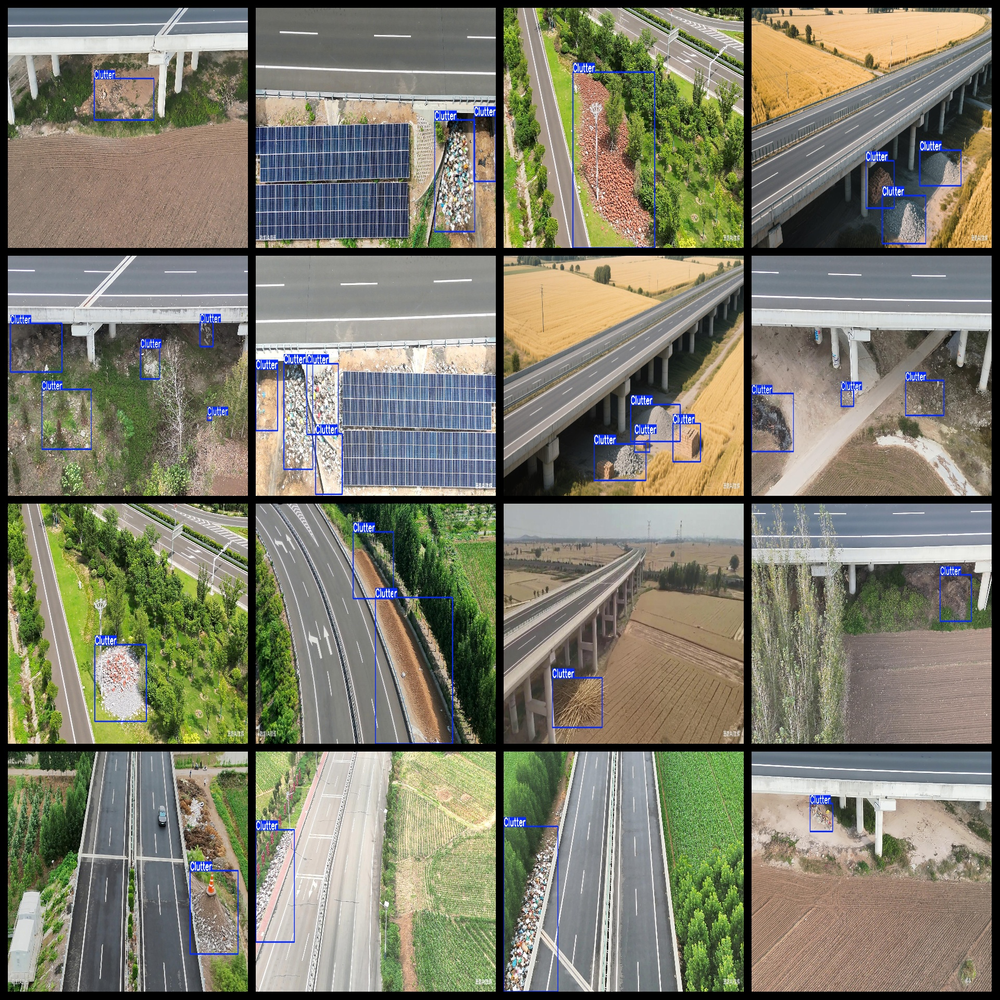
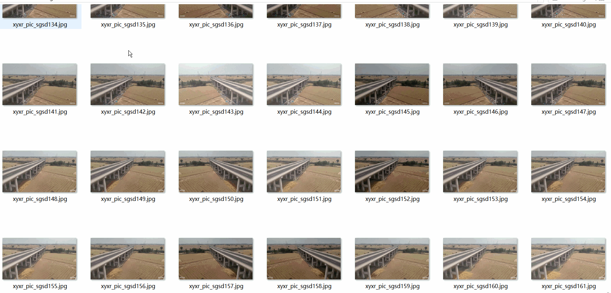

# Aerial High-Speed Road Accumulation Road Surrounding Accumulation Under-Bridge Accumulation Dataset 3709 imagesVOC+YOLO

A dataset of aerial high-speed road accumulation, surrounding accumulation under bridges, containing 3709 images in VOC+YOLO format.

The dataset is organized in Pascal VOC format + YOLO format (excluding the segmentation path's txt file, only including jpg images along with their corresponding VOC format xml files and YOLO format txt files).

Number of images: 3709

Number of annotations: 3709

Number of annotations: 3709

Number of categories: 1

Repository location: datasets_sl

Annotation category names: ["Clutter"]

Number of boxes per category:

Clutter boxes = 7408

Total number of boxes: 7408

Number of images per category:

Clutter images = 3709

Image resolution: Multi-resolution images such as 1536x864, 2048x1152, etc.

Labeling tool used: labelImg

Dataset enhancement: No

Annotation rules: Draw box outlines for each category

Important Notice: The dataset does not contain any split into training, validation, or test sets; users must manually create these.

Special Remark: This dataset does not guarantee the accuracy of the trained models or weight files.

Annotation and image details are as follows:

## Images

---

Here is a pay link on Stripe (https://buy.stripe.com/3cs8yP7sY87d0vu9AB). Please contact me lonlonago@foxmail.com after funding $89, and I will send you a complete data files, thank you!

